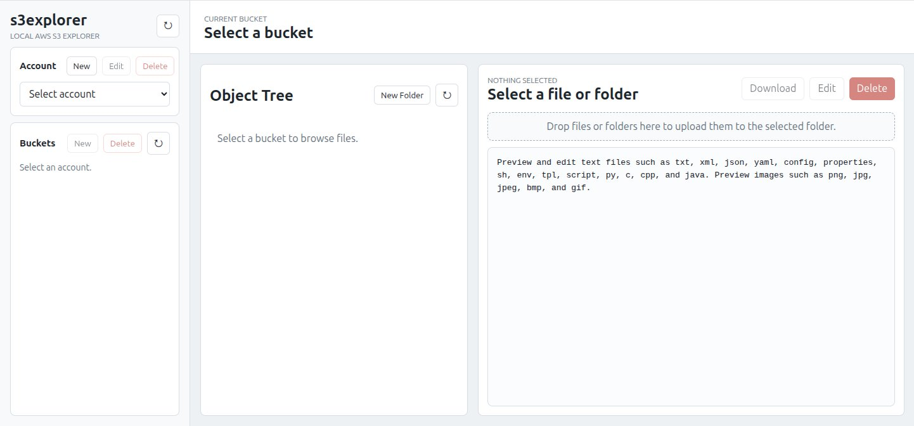

# s3explorer


A local-first AWS S3 browser and editor for developers who need a fast way to inspect buckets, browse objects as a tree, edit text files, and move files between S3 and their machine.

Unlike heavyweight cloud consoles or Electron desktop apps, `s3explorer` runs as a small Python server with a browser UI. It uses the Python standard library for the web layer and `boto3` for S3 operations.

## Screenshot



Keywords: AWS S3 browser, S3 explorer, S3 file editor, S3 bucket viewer, local S3 admin tool, lightweight S3 GUI.

## Highlights

- Lightweight local web app with no frontend build step
- Multi-account AWS S3 browsing from one interface
- Tree-based bucket navigation with lazy loading
- In-browser editing for common text and config files
- Local history snapshots before overwrite
- Drag-and-drop upload for files and folders
- Safe delete confirmation for files and prefixes
- Local download workflow with transfer progress and cancel support

## Table of Contents

- [Why s3explorer](#why-s3explorer)
- [Features](#features)
- [Installation](#installation)
- [Download Packages](#download-packages)
- [Desktop Builds](#desktop-builds)
- [Quick Start](#quick-start)
- [Usage](#usage)
- [Permissions](#permissions)
- [Data Storage](#data-storage)
- [Security Notes](#security-notes)
- [Project Structure](#project-structure)
- [Use Cases](#use-cases)
- [FAQ](#faq)
- [Limitations](#limitations)
- [Development](#development)
- [Contributing](#contributing)
- [License](#license)

## Why s3explorer

Working with S3 often means switching between the AWS Console, the CLI, and local files. `s3explorer` brings those steps together in one place:

- Browse buckets and prefixes in a tree view.
- Open common text-based files directly from S3.
- Edit and save config files back to S3 with a local history snapshot.
- Drag and drop files or full folders into a target prefix.
- Download files and folders to your machine.
- Manage multiple AWS accounts from one lightweight local tool.

This project is a good fit for teams working with:

- application config stored in S3
- ETL or data pipeline definitions
- staging and production environment files
- log, JSON, YAML, and script inspection
- quick operational fixes without building a larger internal tool

## Features

### AWS account management

- Imports profiles from `$HOME/.aws/credentials` and `$HOME/.aws/config` on first start when the local `accounts.json` file is missing or empty.
- Create, edit, and delete local account entries.
- Stores account name, access key ID, secret access key, region, and output format.
- Masks secrets in the UI when listing saved accounts.

### Bucket and object browsing

- Lists all buckets for the selected account.
- Supports creating new buckets from the UI.
- Supports bucket deletion with explicit `delete` confirmation.
- Displays bucket contents as an expandable tree.
- Supports lazy loading and pagination for larger prefixes.
- Lets you select any file or folder and inspect its path and size.

### File preview and editing

- Opens common text-based files directly from S3.
- Previews common image formats directly in the browser.
- Includes inline syntax highlighting for JSON, YAML, Python, C, C++, and Java.
- Supports editing and saving back to S3 from the browser.
- Writes a local timestamped backup to the local history directory before upload.

Supported text extensions include:

`txt`, `xml`, `json`, `config`, `properties`, `conf`, `cfg`, `ini`, `yaml`, `yml`, `md`, `csv`, `log`, `sh`, `env`, `tpl`, `script`, `py`, `c`, `go`, `cpp`, `cc`, `cxx`, `h`, `hpp`, `java`

Supported image preview extensions include:

`png`, `jpg`, `jpeg`, `bmp`, `gif`

### Safe file operations

- Delete files or folders only after typing `delete` as confirmation.
- Create empty folders under the currently selected prefix.
- Download individual files directly from the browser.
- Download folders and large transfers through a local server-side job flow with progress tracking.
- Cancel uploads and downloads in progress.

### Drag-and-drop uploads

- Drop files directly into the selected folder.
- Drop full directories and preserve relative paths.
- Shows upload progress for both single-file and multi-file transfers.

## Installation

You can use `s3explorer` in two ways:

### Option 1. Download a packaged release

If you want to run `s3explorer` without setting up Python, download a prebuilt package from GitHub Releases:

- Linux x64: [s3explorer-linux-x64-v1.0.0.tar.gz](https://github.com/David366AI/s3explorer/releases/download/v1.0.0/s3explorer-linux-x64-v1.0.0.tar.gz)
- Windows x64: [s3explorer-windows-x64-v1.0.0.zip](https://github.com/David366AI/s3explorer/releases/download/v1.0.0/s3explorer-windows-x64-v1.0.0.zip)

After downloading:

- On Linux, extract the `tar.gz` file, enter the extracted `s3explorer/` directory, and run the `s3explorer` executable inside.
- On Windows, extract the `zip` file and run `s3explorer.exe`.

The Linux x64 package is built for `x86_64` or `amd64` systems. If your Linux machine is `arm64`, build and publish an `arm64` package on an `arm64` Linux machine.

### Option 2. Run from source with Python

### Requirements

- Python 3.10+
- AWS credentials with permission to list buckets and read or write objects as needed

### Install dependencies

```bash
python -m venv .venv
source .venv/bin/activate
python -m pip install -r requirements.txt
```

If you do not want a virtual environment, this also works:

```bash
python -m pip install -r requirements.txt
```

## Download Packages

Direct download links for the current release:

- Linux x64: [s3explorer-linux-x64-v1.0.0.tar.gz](https://github.com/David366AI/s3explorer/releases/download/v1.0.0/s3explorer-linux-x64-v1.0.0.tar.gz)
- Windows x64: [s3explorer-windows-x64-v1.0.0.zip](https://github.com/David366AI/s3explorer/releases/download/v1.0.0/s3explorer-windows-x64-v1.0.0.zip)

Source code and all release assets are also available on the GitHub Releases page.

## Desktop Builds

To make `s3explorer` easy to run without a preinstalled Python environment, you can build platform-specific desktop bundles with PyInstaller.

The repository includes helper scripts for all three desktop platforms:

### Windows

```bat
build_windows.bat
```

### Linux

```bash
./build_linux.sh
```

### macOS

```bash
./build_macos.sh
```

All build scripts:

- use an existing system-level `pyinstaller` installation
- bundle the `static/` assets required by the web UI
- create a distributable folder under `dist/s3explorer/`
- generate a release archive for the target platform after the build finishes

Build prerequisite:

- install `pyinstaller` before running the build scripts
- the scripts do not create or use a project virtual environment
- on Linux, install it using your system package manager or another system-level method

Platform notes:

- Windows output includes `dist/s3explorer/` and a `dist/s3explorer-windows-<arch>.zip` archive
- Linux output includes a native Linux executable named `s3explorer` and a `dist/s3explorer-linux-<arch>.tar.gz` archive
- macOS output includes a native macOS executable named `s3explorer`

Runtime behavior of the packaged app:

- the app automatically opens the browser after launch
- static files are loaded from the bundled application resources
- user data is stored outside the install folder
- on Windows, account data and history are stored under `%APPDATA%\s3explorer`
- on Linux and macOS packaged builds, user data is stored under `$XDG_DATA_HOME/s3explorer` or `~/.local/share/s3explorer`

Important:

- build on the same target platform you plan to distribute to
- use `build_windows.bat` on Windows, `build_linux.sh` on Linux, and `build_macos.sh` on macOS
- PyInstaller does not reliably produce Windows executables from Linux or macOS, or vice versa

## Quick Start

There are two common ways to start using `s3explorer`:

### Run the packaged app

- Linux: extract the release package, enter the `s3explorer/` directory, and run `./s3explorer`
- Windows: extract the release package and run `s3explorer.exe`

If port `8000` is already in use on your machine, start the packaged app with a different host or port:

```bash
cd s3explorer
./s3explorer --host 127.0.0.1 --port 9000
```

On Windows:

```bat
s3explorer.exe --host 127.0.0.1 --port 9000
```

### Run with Python

Start the local server:

```bash
python server.py
```

By default, the app opens your browser automatically after startup. To disable that behavior:

```bash
python server.py --no-browser
```

Open:

```text
http://127.0.0.1:8000
```

You can also override the host and port:

```bash
python server.py --host 127.0.0.1 --port 8001
```

This is useful when port `8000` is already occupied by another local service.

## Usage

### 1. Load or add an AWS account

On first launch, `s3explorer` tries to import profiles from your local AWS config files.

If you want to add an account manually, use the account panel and provide:

- profile name
- key ID
- access key
- region
- output format

### 2. Select a bucket

After choosing an account, the app loads all accessible buckets. Click a bucket to open its object tree.

### 3. Create a bucket

Use the bucket toolbar to create a new bucket for the selected account:

1. Click `New Bucket`.
2. Enter a globally unique S3 bucket name.
3. Confirm creation.

If the bucket name already exists anywhere in AWS S3, creation will fail and the app will show the error.

### 4. Delete a bucket

To reduce accidental removal, bucket deletion requires an explicit confirmation:

1. Select the bucket you want to remove.
2. Click `Delete Bucket`.
3. Type `delete` in the confirmation dialog.
4. Confirm the deletion.

The bucket must already be empty before S3 allows it to be deleted.

### 5. Browse and inspect objects

- Click folders to expand prefixes.
- Click supported text files to preview their content.
- Click supported image files to preview them directly in the viewer.
- Select any file or folder to enable download or delete actions.

Supported image preview formats:

`png`, `jpg`, `jpeg`, `bmp`, `gif`

### 6. Preview an image

For supported image formats:

1. Open a bucket and browse to an image file.
2. Click the image object in the tree.
3. View the image directly in the built-in preview panel.

### 7. Edit a text file

For supported text formats:

1. Select the file.
2. Click `Edit`.
3. Update the content.
4. Click `Save`.

Before the new content is uploaded to S3, a local snapshot is stored in the local history directory.

### 8. Upload files or folders

Drag files or directories from your desktop into the main workspace. If a folder is selected, uploads go into that prefix. If a file is selected, uploads go into its parent folder.

### 9. Download files or folders

- File downloads can use the browser save dialog when supported.
- Folder downloads use the local server workflow and save to a directory on your machine.
- Long-running downloads show progress and can be canceled.

## Permissions

The exact AWS permissions depend on how you use the tool. For read-only browsing, listing and object reads are enough. For editing, uploading, deleting, and folder creation, write permissions are also required.

A minimal example policy for a specific bucket looks like this:

```json
{
	"Version": "2012-10-17",
	"Statement": [
		{
			"Effect": "Allow",
			"Action": [
				"s3:ListAllMyBuckets",
				"s3:GetBucketLocation"
			],
			"Resource": "*"
		},
		{
			"Effect": "Allow",
			"Action": [
				"s3:ListBucket"
			],
			"Resource": "arn:aws:s3:::YOUR_BUCKET"
		},
		{
			"Effect": "Allow",
			"Action": [
				"s3:GetObject",
				"s3:PutObject",
				"s3:DeleteObject"
			],
			"Resource": "arn:aws:s3:::YOUR_BUCKET/*"
		}
	]
}
```

For production use, narrow permissions to the buckets and prefixes your team actually needs.

## Data Storage

The project keeps a small amount of local state:

- source checkout: `data/accounts.json` and `data/history/` under the project root, created automatically on first run if needed
- Windows packaged app: `%APPDATA%\s3explorer\accounts.json` and `%APPDATA%\s3explorer\history\`

The `data/` directory is runtime data. It may not be present in a fresh source archive or repository snapshot until the app has been started.

These files are intentionally local and are already ignored by `.gitignore`.

## Security Notes

- This is a local tool intended to run on a trusted machine.
- AWS secrets are stored locally in the runtime `accounts.json` file if you create or edit accounts in the UI.
- Local downloads are restricted to paths under your home directory or `/tmp`.
- Destructive delete operations require explicit text confirmation.

If your workflow already uses `$HOME/.aws/credentials` and `$HOME/.aws/config`, prefer importing those profiles instead of duplicating credentials unnecessarily.

## Project Structure

```text
.
├── server.py           # Python HTTP server and S3 API handlers
├── requirements.txt    # Python dependencies
├── static/
│   ├── index.html      # UI shell
│   ├── app.js          # Client-side application logic
│   └── styles.css      # Styles
└── data/               # Runtime-generated local data directory (created on first run)
	├── accounts.json   # Local account storage
	└── history/        # Local edit history snapshots
```

## Use Cases

- Review and patch configuration files in S3 without using the AWS Console.
- Compare and update environment-specific config in staging or production buckets.
- Browse data pipeline artifacts and operational files more quickly than with CLI-only workflows.
- Provide a lightweight internal S3 admin tool for engineers and operators.

## FAQ

### Is this a hosted service?

No. `s3explorer` is a local tool. You run `server.py` on your own machine and open it in your browser.

### Does it upload files directly from the browser to S3?

The browser sends files to the local Python server, and the server performs the S3 upload through `boto3`.

### Are my AWS credentials sent anywhere else?

No external service is involved in the project itself. Credentials are used locally by your running server process to call AWS APIs.

### Can I use it for binary assets?

You can browse, upload, download, and delete binary files, but inline preview and editing are intended for supported text formats.

### Is this meant for multi-user deployment?

Not in its current form. The project is designed as a trusted local utility rather than a shared authenticated web service.

## Limitations

- This project focuses on S3 object browsing and editing, not full AWS resource management.
- Binary file preview is not supported.
- Authentication is based on local credentials you provide or import.
- The app is designed for trusted local use rather than multi-user deployment.

## Development

Install dependencies and run the server locally:

```bash
python -m pip install -r requirements.txt
python server.py
```

There is no frontend build step.

To build distributables:

```bat
build_windows.bat
```

```bash
./build_linux.sh
./build_macos.sh
```

## Contributing

Issues and pull requests are welcome.

Useful contribution areas:

- better error handling for AWS edge cases
- UI improvements for very large buckets
- additional text preview formats
- tests for S3 operations and local job handling
- packaging and release automation

## License

This project is licensed under the MIT License. See `LICENSE` for details.
